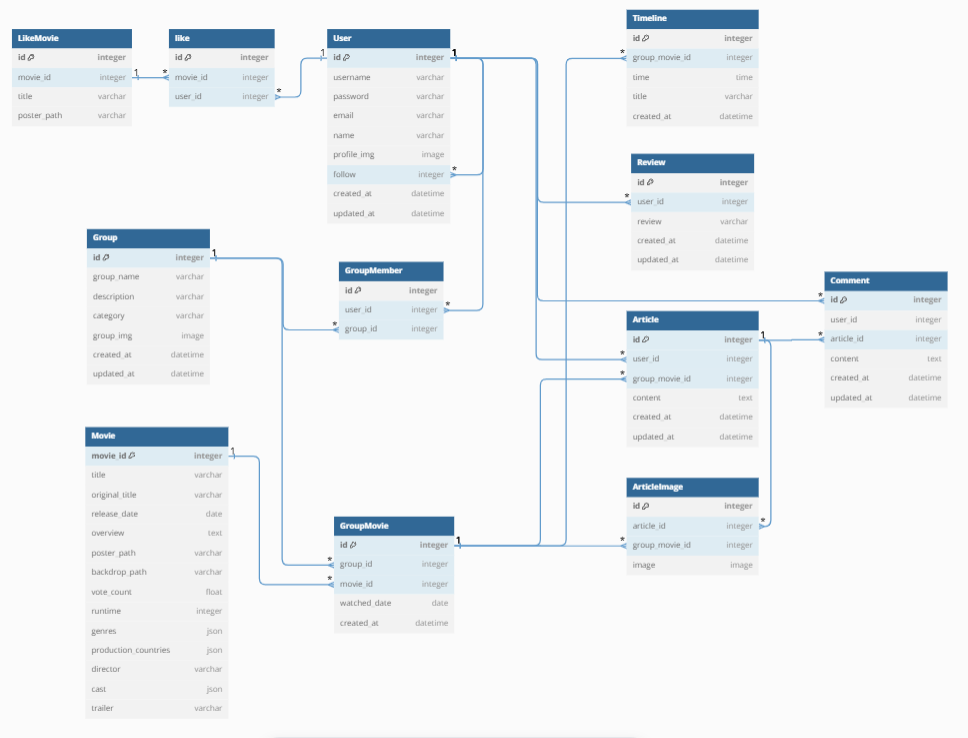

# 영화처럼, 순간처럼 🎬
> 영화메이트와 함께 본 영화의 추억을 기록하는 서비스

## 1. 프로젝트 개요
- 가입한 회원을 대상으로 한 영화 추천, 정보 제공 서비스
- 프로젝트 기간 : 2024.11.18 ~ 2024.11.27 (10일)
- 팀명 : CoDream
- 팀원 : 김은영 (BACKEND), 이송희 (FRONTEND)

## 2. 핵심(메인) 기능
- 사용자 맞춤 영화 추천 서비스
- 가족, 연인, 친구 등 다양한 그룹별 영화 감상 기록
- 사진, 감상평, 타임라인 등 다양한 형태의 기록 시스템 지원
- 그룹 멤버들과 즉시 공유되는 기록 시스템

## 3.기술 스택 & Tools
- Backend
<div align="center">
 

 
</div>

- Frontend
<div align="center">


</div>

- Tools
<div align="center">
 
 
 
</div>

## 4. ERD (dbdiagram.io)

```// Use DBML to define your database structure
// Docs: https://dbml.dbdiagram.io/docs

Table User {
  id integer [primary key]
  username varchar [unique]
  password varchar
  email varchar [unique]
  name varchar
  profile_img image
  follow integer
  created_at datetime
  updated_at datetime
}

Table LikeMovie {
  id integer [primary key]
  movie_id integer
  title varchar
  poster_path varchar
}

Table like {
  id integer [primary key]
  movie_id integer
  user_id integer
}

Table Group {
  id integer [primary key]
  group_name varchar
  description varchar
  category varchar
  group_img image
  created_at datetime
  updated_at datetime
}

Table GroupMember {
  id integer [primary key]
  user_id integer
  group_id integer
}

Table Movie {
  movie_id integer [primary key]
  title varchar
  original_title varchar
  release_date date
  overview text
  poster_path varchar
  backdrop_path varchar
  vote_count float
  runtime integer
  genres json
  production_countries json
  director varchar
  cast json
  trailer varchar
}

Table GroupMovie {
  id integer [primary key]
  group_id integer
  movie_id integer
  watched_date date
  created_at datetime
}

Table Timeline {
 id integer [primary key]
 group_movie_id integer  
 time time
 title varchar
 created_at datetime
}

Table Review {
 id integer [primary key]
 user_id integer  
 review varchar
 created_at datetime
 updated_at datetime
}

Table Article {
 id integer [primary key]
 user_id integer 
 group_movie_id integer
 content text
 created_at datetime
 updated_at datetime
}

Table ArticleImage {
 id integer [primary key]
 article_id integer
 group_movie_id integer
 image image
}

Table Comment {
  id integer [primary key]
  user_id integer
  article_id integer
  content text
  created_at datetime
  updated_at datetime
}

Ref: GroupMember.user_id > User.id
Ref: GroupMember.group_id > Group.id
Ref: GroupMovie.group_id > Group.id
Ref: GroupMovie.movie_id > Movie.movie_id
Ref: like.user_id > User.id
Ref: Timeline.group_movie_id > GroupMovie.id
Ref: Article.user_id > User.id 
Ref: Article.group_movie_id > GroupMovie.id
Ref: ArticleImage.article_id > Article.id
Ref: ArticleImage.group_movie_id > GroupMovie.id
Ref: "User"."id" < "User"."follow"
Ref: "LikeMovie"."movie_id" < "like"."movie_id"
Ref: "User"."id" < "Review"."user_id"
Ref: "Article"."id" < "Comment"."article_id"
Ref: "User"."id" < "Comment"."id"
```

## 5. 프로젝트 구조
```
📁 movie-diary-project/
├── README.md
├── .gitignore
│
├── 📁 frontend/            
│   ├── README.md
│   ├── .gitignore
│   ├── package.json
│   ├── vite.config.js
│   │
│   └── 📁 src/
│       ├── App.vue
│       ├── main.js
│       │
│       ├── 📁 assets/
│       │   ├── 📁 images/
│       │   └── 📁 styles/
│       │
│       ├── 📁 components/
│       │   ├── 📁 common/
│       │   │   └── AppNavBar/
│       │   │
│       │   ├── 📁 GroupWatchedMovie/
│       │   │   ├── Article.vue
│       │   │   ├── Gallery.vue
│       │   │   ├── OneLineReview.vue
│       │   │   └── TimeLine.vue
│       │   │
│       │   ├── ArticleModal.vue
│       │   ├── Chatbot.vue
│       │   ├── GroupCreateModal.vue
│       │   ├── GroupMovieCreateModal.vue
│       │   ├── MovieWatchCard.vue
│       │   └── MovieCard.vue
│       │
│       ├── 📁 views/
│       │   ├── HomeView.vue
│       │   ├── MovieView.vue
│       │   ├── MovieDetailView.vue
│       │   ├── LoginView.vue
│       │   ├── SignUpView.vue
│       │   ├── GroupDetailView.vue
│       │   └── ProfileView.vue
│       │
│       ├── 📁 router/
│       │   └── index.js
│       │
│       └── 📁 stores/
│           └── counter.js
│
└── 📁 backend/
    ├── README.md
    ├── requirements.txt
    ├── manage.py
    │
    ├── 📁 movie_api/
    │   ├── __init__.py
    │   ├── asgi.py
    │   ├── settings.py
    │   ├── urls.py
    │   └── wsgi.py
    │
    ├── 📁 accounts/
    │   ├── migrations/
    │   ├── __init__.py
    │   ├── admin.py
    │   ├── models.py
    │   ├── serializers.py
    │   ├── urls.py
    │   └── views.py
    │
    └── 📁 group_movies/
        ├── migrations/
        ├── __init__.py
        ├── admin.py
        ├── models.py
        ├── serializers.py
        ├── urls.py
        └── views.py
```

## 6. 주요 기능
### 로그인, 로그아웃, 회원가입
- django-rest-auth 라이브러리 활용
- user 모델 커스텀 (name, profile_img 필드 추가)
- 비로그인 유저는 기능이 제한되어 로그인, 회원가입 페이지 외 접근 제한
- 로그아웃 시 로그인 페이지로 이동

### 영화 데이터 (최소 50개 이상)	
- TMDB API를 통해 영화 데이터 정보 Movie 모델 DB 저장
- 영화 리스트 요청 후 id를 통해 상세 정보 재요청하여 상세 정보 저장

### 영화 목록 조회	
- 추천 영화 
  : TMDB API로부터 받아 저장한 50개 이상의 데이터로부터 랜덤으로 최대 10개 추천
- 박스오피스
  : TMDB API 요청
- 현재상영작
  : TMDB API 요청
- 개봉예정작
  : TMDB API 요청

### 영화 상세 목록 조회	
- 영화 목록에서 영화 선택
- 영화 목록 조회에서 요청하여 받은 영화 id를 통해 TMDB API 상세 정보를 요청하여 제공
- 영화명, 개봉년도, 상영시간, 장르, 출연진, 사진 등 제공
- 영화 찜하기(좋아요) 기능

### 커뮤니티 게시글, 댓글
- 그룹을 만들어 함께 본 영화를 기록
- 타임라인 : 함께 본 날의 하루를 기록, 그룹에 속한 사람이라면 누구나 삭제 가능
- 한줄평 : 간단한 메모, 감상평, 명대사 등을 기록
- 게시글 : 사진 첨부, 토글을 사용하여 각 게시글의 댓글 기록
  - ArticleImage 모델 설계로 Article 모델과 N:1관계를 통해 1개의 게시글마다 여러 장의 사진 첨부 가능
- 갤러리 : 게시글에 첨부한 사진 모아보기
  - ArticleImage 모델을 GroupMovie와도 N:1 관계 설정으로 사진 모아보기 가능

### 찜하기(좋아요)
- 영화 상세 페이지를 통해 좋아요 기능 구현
- User 모델과의 관계를 위해 LikeMovie 모델 설계하여 M:N 관계 설정 
  - Movie 모델에 저장하여도 되었으나 데이터 용량 고려, 프로필에서 찜한 영화 목록 조회를 위해 title, poster_path 필드 추가

### 프로필 조회
- 사용자 정보 조회, 수정, 삭제
- 작성한 게시글 수, 팔로잉 수, 팔로워 수
- 최근 작성한 글
- 찜한 영화

### 팔로우
- User 모델에서 자신과 M:N 관계 설정
- 대칭적 관계가 아니므로  `symmetrical=False` 속성 설정
- 팔로우 상태 확인을 위해 DB에서 포함 여부를 확인하여 응답을 boolean으로 제공 -> 반응성 시스템이 변경을 감지하고 즉시 화면을 갱신

### 영화 추천 알고리즘
- 추천 영화 
  : TMDB API로부터 받아 저장한 50개 이상의 데이터로부터 랜덤으로 최대 10개 추천
  - 사용자가 그룹에서 본 영화를 기록하면 해당 영화 정보가 Movie DB로 저장
  - 해당 DB는 사용자의 기록 서비스 이용에 따라 데이터 증가로 더 다양한 추천 가능

### 검색 서비스
- 사용자 검색 : email, name 중 부분일치하는 사용자를 검색하여 출력
- 그룹 검색 : 그룹명 검색을 통해 출력, 카테고리 설정을 통해 필터 기능
- 영화 검색 : TMDB API 요청

### AI
- 기능 : 영화 추천, 영화 정보 제공
- 사용 모델 : GPT-4o min
- 장르와 분위기 기반 추천
- 비슷한 영화 기반 추천
- 영화 이름 정보 제공


## 7. API 명세서
- (추후 작성 예정)
## 8. 일정 관리 & 업무 분담
- (추후 작성 예정)


## 9. 후기(느낀점, 어려웠던점, 배운점 등)
### 이송희 
- ERD, API 명세서 회의록 등 체계적인 문서화를 통해 개발 전 FE와 BE 간 충분한 소통과 설계의 중요성을 체감
- Git 브랜치 컨벤션을 작성을 통한 체계적이고 지속적인 코드 관리의 필요성을 체감
- 컴포넌트 설계와 상태 관리 패턴에 대한 이해도 향상
- 이미지 처리 및 저장 로직 최적화
- TMDB API 연동 및 데이터 가공
- UI/UX의 중요성을 채감하고 이를 반영하고자 함
- 컴포넌트 간 데이터 흐름 설계
- 검색 기능 설계

### 김은영
- ERD Model 설계와 API 명세서의 중요성을 깨달음
- API 명세서를 기반으로 Frontend와 Backend의 역할을 확실히 구분하여 개발할 수 있음
- 그룹 관계 설정에 대한 어려움이 있었음
- 프로젝트 초반 Frontend와 Backend의 역할에 대해 구분이 명확하지 않아 어려움이 있었음
- User 모델을 커스텀
- 시리얼라이즈의 사용법
- url 주소 구분
- 예외 처리 부분


## 10. 추가 기능 예정
- 팔로워, 팔로잉한 사용자 확인
- 그룹 신청 요청(수락, 거절)
- 챌린지 서비스
- 비밀번호 수정
- 공유를 통한 전체 커뮤니티
- 나만의 방, 오픈방 (동일 그룹 제한)